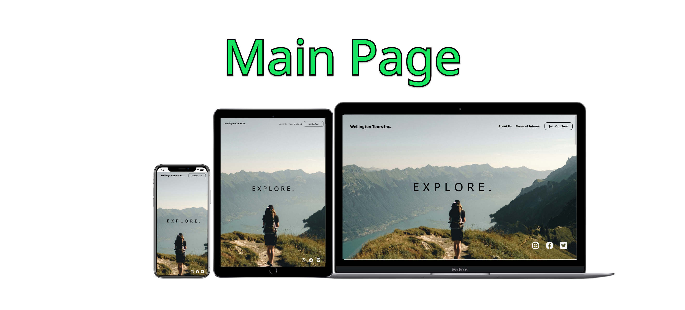
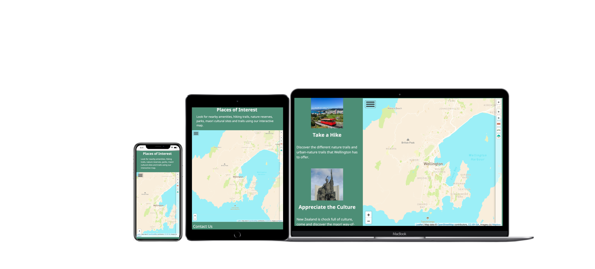
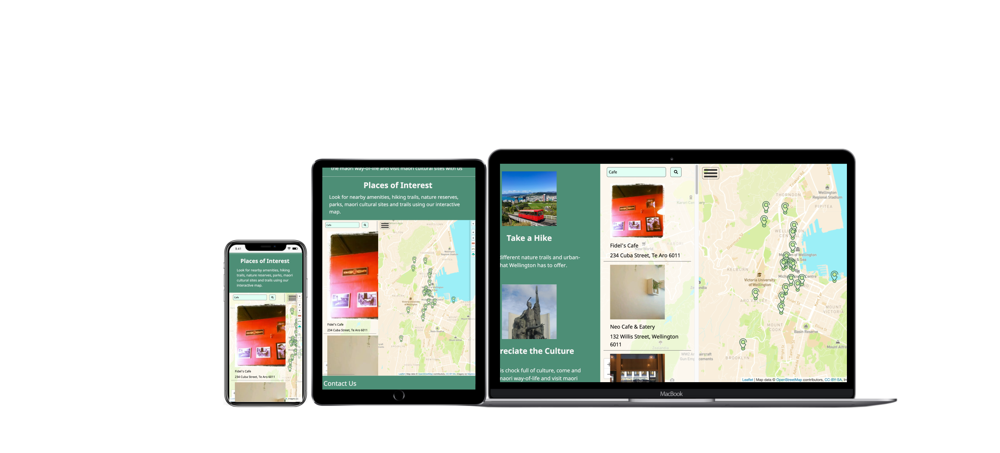

# **Discover-Wellington**
 

## Project Summary

**Project Context**

This project is a mockup of a tour agency who specialises in arranging tours in New Zealand, Wellington.  

**Organisational Goals**

The organisation aims to provide a service and entice people to join their tours and provides an interactive map app listing the locations of parks and reserves, tracks, heritage trees and cultural sites in Wellington.

**User Goals**

The aim of users will be for interested parties looking for a holiday in Wellington and do not know where to go, the app can help the prospective user to find nearby amenities and the nearest park or track closest to them to visit as a value-add.

## UX/UI

### **Objective**

The aim for the UI of this website is to provide a hero with a parallax layer to instil a sense of adventure and movement. The content layout was designed for simplistic and minimalistic styling to allow the content stand out. For the UX, I decided to go with a linear experience so that the user can access all the content in just a scroll.

### **Strategy**

_Organisation_
* Objective: To provide a service to enable potential tourists to view the possible options to go sightseeing and to entice the user to contact the organisation.

_User_
* Objective: To find a website that knows Wellington's culture and nature well.

* Needs: A knowledgeable website with good value-add

* Demographics:
    * Tourists looking for an tour agency that knows the culture well
    * Nature lovers looking for Wellington's parks and reserves
    * Cycling Enthusiasts who'd like to go mountain biking and cycling around Wellington

* Pain point: Unable to find an agency that provides all the information in an app with a single scroll.

### **User Stories**

User Stories | Acceptance Criteria(s)
------------ | -------------
As a person who is looking to travel, I want to be able to find an agency that understands the culture and knows where are the places I can visit in Wellington, and which is the closest hotel I should stay at to make the trip shorter.  | Search function and Park Markers, cultural site and track markers.
As a person who is a nature lover, I want to know what are the tracks I can visit to go trekking and admiring nature in Wellington. | Feature that can allow user to see heritage trees, tracks and parks and reserves.
As a cycling enthusiast, I want to go mountain biking and also go cycling around Wellington to admire the city and what it has to offer| Feature that allows user to see cycling racks, mountain biking tracks and search menu for if they'd like to visit a cafe that they are heading towards. 

### **Scope**

_Functional Specifications_

1. A collapsible layer group that can toggle on/off the map layers.

2. Search function to allow user to search items of interest to the user

3. Allow user to contact the tour agency through a contact form.

_Functional Content Requirements_

1. Information on the map layer(Parks and reserves, cultural sites, heritage trees, tracks and cycling racks)

2. Copywriting on Wellington to entice users to visit

_Non-functional requirements_
* Mobile responsiveness
    * Achieved via the use of media queries and CSS grid and flexbox
* Performance

### **Structure**

_Content Info_

This is a app website that incorporates a linear experience. The webpage is spread into a layout with the navbar, parallax-hero, map in a grid column, content in a single column seperated by two rows by flex, contact-form and footer.

1. When the user enters the website, they see the hero with the title-explore and our brands and the navbar right away.
2. The user can point their mouse easily towards the navbar's about us, check out places of interest and to join our tours. Upon hovering the links, it changes color to an earthy green tone. 
3. As the user scrolls down, the user gets a sense of a 3d space, which makes the user feel like they are there in the image like how we perceive distances and the way things move in the background so as to entice the user.
4. On the bottom left, we have the social container that's contrasted with the background, upon hovering the color changes.
5. Upon scrolling down, the user can see some copywriting to entice them to visit Wellington.
6. On the right there's a map app the user can use to explore places of interest to them.
7. On the top left of the map app, the user can toggle a search menu button to look for nearby amenities. To the right there's a collapsible toggle bar to toggle layers and different map style.
8. Scrolling further down we have the contact-form for the user to submit to get in touch with us.
9. The footer includes my project design and github and linkedIn links.

 

## Map

### **Features**

In the map section, there are two toggle-able functions.

1. Upon mouse entering the right side of the map, it will toggle the collapsible-layer bar to show, which controls the layers to be displayed.

2. Upon clicking the button on the top right, an empty display will shoot out from the left and allows the user to search for nearby amenities. 

 

### **Search**

* User can search for nearby amenities based on the center of the map, limited to the first 20 results.
* Upon searching, pictures will show along with the venue, venue name and address and markers will be placed in the map.
    * When the picture/venue name is clicked, the event will cause the map to fly to the marker.
* Searching for new results will clear previous search results and will remove the markers on the map and replace it with new ones as well.

### **Mobile Responsiveness**

* The map is mobile responsive and it will switch layouts
    * Laptop layout will show it as part of a column
    * Tablet and Mobile layout will display the map at full width but at 2/3 the height.

## Layer

### **Collapsible tab**
* Collapsible tab helps to save screen space and allows user to easily filter between markers and layers.

### **Customised Icons and Legends**
* Customised Icons and legends allow users to identify what the user is filtering and is representative of the content it represented instead of the default leaflet icon marker.

## Colors
* Obsidian and whitesmoke were used for the borders and texts to allow them to stand out against the background
* Earthy colors such as shades of green and browns were used to evoke thoughts of nature and further entice the user to travel
    * Picture below shows the shades of color palettes used.

 

## Typography
* Noto Sans Serif was used for a more modern feel.
* Font size is adjusted according to device size for readability.
* Font weights were used appropriately for sub-headers and content.

|Category      |Input / Actions                |Output / Errors                                                                     |
| :-------     | :------------                 | :-------------------                                                               |
|Overall       |Mobile Responsive              |No error                                                                            |
|Nav Bar       |Mobile Responsive              |About us and Places of interest will hide when shown on mobile screens              |
|Map           |On load / Click                |All markers and details shown                                                       |
|Search-bar toggle|Mobile Responsive           |No Error, when clicked, will display search container                               |
|Search-container |Search                      |Upon search, pictures and venue names and venue address will show. Places with no interior image will not show. Typing in a new search will reset search results and markers|
|Search-container | On click on search results |When search results are clicked. Map will fly to marker                             |
|Collapsible layer|Display/hide layers and markers |When checked, map layer and markers will display/hide                           |
|Markers       |On click                       |Will show popup of name to user, for track Marker, will display bootstrap table in the popup showing track type, and track name.|
|Contact-form  |Validation                     |When user does not provide any name, mobile number or select a radio button and gives an invalid email address, appropriate error messages will show.                                                               |
|Footer icon   |On click                       |Re-directs user to my github and linkedIn                                           |

## Technology
* HTML
* CSS
* Javascript
* [LeafletJS](https://leafletjs.com/) use for map and popups, customisable icons
* [Leaeflet-panel-layers](https://github.com/stefanocudini/leaflet-panel-layers) by Stefano cudini for the collapsible leaflet layer control group
* [Foursquare](https://foursquare.com/) for their places API used in search function.
* [axios](https://github.com/axios/axios) for getting file data from geoJSON and APIs.
* [Bootstrap](https://getbootstrap.com) for map marker popup table for track data. 
* [FontAwesome](https://fontawesome.com) for different webpage icons.
* [Photoshop](https://www.adobe.com/products/photoshop.html?promoid=RBS7NL7F&mv=other) For allowing me to edit the hero image into seperate layers
* [Figma](https://www.figma.com) for prototyping, track legend and installing readme images.
* [Multi-Device-Mockup-Generator](https://techsini.com/multi-mockup/) for the multi-device used for my readme images.

## Credits

### **Images**

[unsplash-hero-image](https://unsplash.com/photos/znoL1m6MD_k) Photo courtesy of hero image by Joel & Jasmine Forestbird

[unsplash-cable-image](https://unsplash.com/photos/zucg5jX_Uek) Photo courtesy of Wellington Cable car by Jil Beckmann

_Kupe Statue Image_

>Kupe statue. Nathan, Simon, 1943-: Photographs of the Kermadec Islands, Antarctica, Inangahua, Mount Ngauruhoe, and various New >Zealand locations. Ref: PADL-002063. Alexander Turnbull Library, Wellington, New Zealand. /records/45620847

### **Icons**
[svgrepo](https://www.svgrepo.com/) used for my customised map markers.

### **Data**
[Wellington-Data](https://data-wcc.opendata.arcgis.com/) GeoJSON Data provided open source from Wellington's City Council